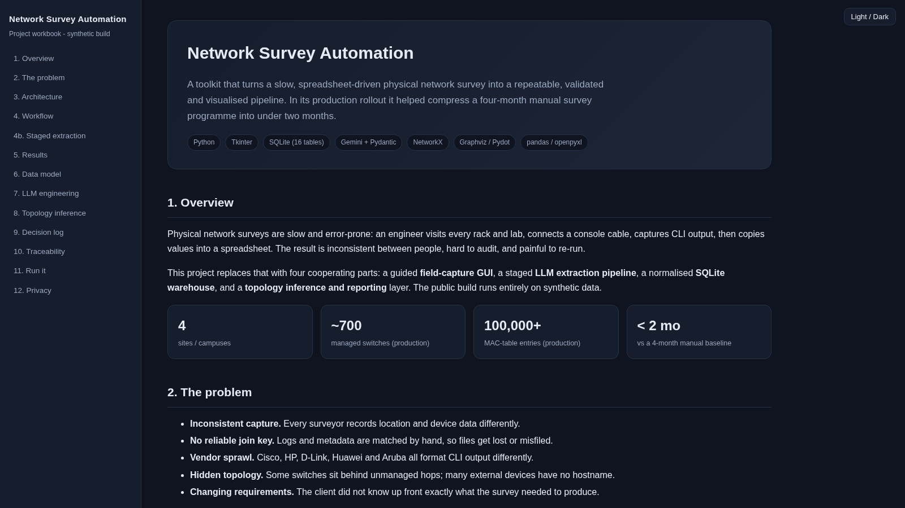
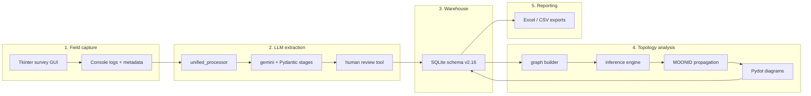

# Network Survey Automation

**From a 4-month manual network survey to a repeatable pipeline delivered in under 2 months.**

Python 3.10+ · SQLite · Gemini + Pydantic · NetworkX · Graphviz · non-commercial license

> ⚠️ **Heavily sanitised showcase build.** This is a de-identified, synthetic
> reconstruction of an internal project, published to demonstrate the engineering.
> All employer, customer, device and personal data has been removed or fabricated.
> See [docs/SANITIZATION.md](docs/SANITIZATION.md). Licensed for **non-commercial use only**.

**My role:** designed and built the toolkit end-to-end, then led the survey using it.

| Sites | Managed switches | MAC-table entries | Diagram artefacts | Delivery |
| --- | --- | --- | --- | --- |
| **4** | **~700** | **100,000+** | **~90** | **under 2 months** |

*Production rollout figures (anonymised). The committed demo dataset is smaller and fully synthetic.*

**The problem:** engineers walked every rack, copied CLI output by hand, and keyed
spreadsheets - slow, inconsistent, hard to audit.
**What I built:** a capture GUI, a staged LLM extraction pipeline, a SQLite warehouse,
and a topology inference engine.
**The result:** consistent, auditable data and a survey completed in less than half the
baseline time.

**Explore:** [Interactive workbook](docs/workbook.html) · [Architecture](docs/diagrams/architecture.html) · [Workflow](docs/diagrams/workflow.html) · [Staged extraction](docs/diagrams/sequence.html) · [Decision log](docs/DECISIONS.md) · [Traceability](docs/TRACEABILITY.md) · [Sanitisation notice](docs/SANITIZATION.md)

---

## Why this exists

A physical network survey means walking hundreds of labs and racks, plugging a console
cable into every switch, copying the output, and then hand-keying thousands of rows into
spreadsheets across several engineers. The result is slow, inconsistent between
surveyors, hard to audit, and painful to re-run.

This project replaces that workflow with a four-part system:

1. **Field capture** - a Tkinter GUI that makes surveyors record metadata in one
   consistent shape and tells them exactly where to save each console log.
2. **LLM extraction** - a staged Gemini + Pydantic pipeline that parses raw CLI logs
   into a strict JSON schema (interfaces, VLANs, IP interfaces, MAC/ARP tables, routes,
   LLDP/CDP neighbours, MOONID associations).
3. **Analysis** - topology inference over a SQLite warehouse: switch role inference,
   MAC-based uplink inference, AP-to-switch linking, and top-down MOONID propagation.
4. **Reporting** - Graphviz/Pydot topology diagrams plus Excel/CSV inventory, vendor,
   port-capacity and unassigned-network reports.

## Architecture

The diagram below is Mermaid (flowchart LR):

## Engineering highlights

- **Staged LLM prompting.** Logs are parsed in three passes - Stage 1A (simple fields),
  Stage 1B (MOONID association), Stage 2 (MAC table, chunked into batches). Each stage is
  constrained by a Pydantic model, so a malformed model response fails loudly instead of
  silently poisoning the database.
- **Deterministic log discovery.** A pre-created folder convention
  (site/building-floor-wing-area) means the backend can locate every log with no manual
  mapping, even when hundreds of surveyors save files independently.
- **Topology inference without full discovery data.** The engine reconstructs switch
  roles (Core / Distribution / Access / Router) from connectivity and betweenness
  centrality, infers switch-to-switch uplinks from shared MAC tables, de-duplicates
  external LLDP/CDP neighbours across several identifier forms, and links access points
  by exact MAC match with a systematic last-octet variation fallback.
- **MOONID propagation.** Anchored on the Floor Access Switch, subnet identifiers are
  propagated top-down through the inferred hierarchy, so hosts inherit a
  user-network identity even when the device never reports one directly.
- **Multi-vendor.** Cisco, HP, D-Link, Huawei and Aruba logs are all consumed by the same
  pipeline.
- **Parallelism and resilience.** Batch processing uses a process pool; every LLM call has
  retry handling and every stage emits a structured "items for review" list for humans.

## Glossary

- **MOONID** - *Managed Operations Network ID*. A synthetic, de-branded stand-in for the
  internal network-segment identifier that maps an IP range and VLAN to the owning user
  network. Within a survey it is the join key between switches/access points and the
  subnet they serve, and MOONIDs are propagated top-down through the inferred topology.
  Every MOONID in this repository is fabricated (for example MOON100001); the real
  identifier scheme is proprietary and is deliberately not reproduced.
- **Business group** - a business unit or division that owns a network segment (for
  example a labs, services or industrial division). In this synthetic build the values
  are generic labels such as GROUP-01..GROUP-12.
- **campus_id** - the campus identifier a device or network belongs to. A campus can
  contain multiple buildings. In this synthetic build it is derived from the synthetic
  site code (for example SITE-A).

## Repository layout

    .
    |-- main_app.py                 # thin launcher for the GUI
    |-- pyproject.toml              # package metadata + dependencies
    |-- netsurvey/                  # the application package
    |   |-- config.py, utils.py
    |   |-- gui/          main_app.py, data_manager.py, ui_components.py
    |   |-- db/           create_db.py, create_log_folders.py, load_*.py
    |   |-- llm/          unified_processor.py, gemini.py, review tool, prompts/
    |   |-- topology/     network_diagram_generator.py, diagram_*.py, infer_*.py
    |   |-- reporting/    export*.py, vendor_report.py, extract_unassigned_networks.py
    |-- tools/            generate_synthetic_data.py, generate_demo_diagrams.py
    |-- legacy/           earlier prototypes, archived with notes
    |-- docs/             documentation set (see the map below)
    |-- data/                                     synthetic reference data
    |-- survey_outputs/                           synthetic field output
    |-- validated_jsons_api_structured_MAC_CHUNKED_MP/   synthetic parsed output
    |-- organized_llm_input_packages/             synthetic LLM input packages
    |-- network_diagrams_pydot_final/             generated diagrams + uplink JSON

## Documentation map

A single README cannot explain a system built incrementally over several months. The
project therefore ships a documentation set, each piece answering a different question.
Start with the workbook if you want the full guided tour.

| Document | Question it answers |
| --- | --- |
| docs/workbook.html | The full guided explanation, with interactive diagrams (open in a browser) |
| README.md (this file) | What is it and why should I care? (5-minute read) |
| docs/ARCHITECTURE.md | How is it put together? |
| docs/DECISIONS.md | Why was each major choice made? (evidence-based ADR log) |
| docs/TRACEABILITY.md | Where did every original file go? |
| docs/SANITIZATION.md | What was removed or fabricated for public release? |
| docs/TECHNICAL_REFERENCE.md | How do I operate every phase? (original runbook) |
| docs/diagrams/ | Interactive architecture and workflow viewers (self-contained HTML) |
| legacy/README.md | What was tried before, and why did it change? |

## Quickstart

Prerequisites: Python 3.10+, Graphviz (dot) on your PATH, and on Linux the python3-tk
package for the GUI.

    python -m venv .venv
    source .venv/bin/activate        # Windows: .venv/Scripts/activate
    pip install -r requirements.txt

Rebuild the whole synthetic demo from scratch:

    ./run_demo.sh                    # small profile (default)
    ./run_demo.sh full               # larger, closer to production scale

Or step by step:

    python tools/generate_synthetic_data.py --profile small
    python -m netsurvey.db.create_db
    python -m netsurvey.db.load_other_devices_json_to_db
    python -m netsurvey.db.load_validated_json_to_db
    python tools/generate_demo_diagrams.py
    python -m netsurvey.reporting.extract_unassigned_networks

Launch the survey GUI (either form works):

    python main_app.py
    python -m netsurvey.gui.main_app

Run the LLM extraction pipeline (needs credentials):

    cp .env.example .env             # then set GEMINI_API_KEY
    python unified_processor.py

## What the demo build contains

The committed demo data is generated by tools/generate_synthetic_data.py:

| Item | Small profile | Full profile |
| --- | --- | --- |
| Sites | 4 | 4 |
| Lab areas | 24 | 52 |
| MOONIDs | ~56 | ~250 |
| Managed switches | ~47 | ~720 |
| Validated JSON records | ~47 | ~720 |
| Topology diagrams | ~43 | ~700 |
| Other / unmanaged devices | ~44 | ~600 |

The production rollout (anonymised) covered 4 sites and roughly 50 lab areas, several
hundred managed switches and unmanaged devices, a few hundred network segments,
100,000+ MAC-table entries, tens of thousands of interfaces, a few thousand LLDP/CDP
adjacencies, and around 90 generated diagrams.

## Data and privacy

This repository is safe to publish because all content is fabricated. The generator is
deliberately strict:

- **Hostnames** use the reserved domain lab.example.com (RFC 2606).
- **MAC addresses** use the locally-administered prefix 02:00:00:..., so they cannot
  collide with any real vendor OUI.
- **IP addresses** use reserved blocks only: RFC 5737 documentation ranges
  (192.0.2.0/24, 198.51.100.0/24, 203.0.113.0/24) and the RFC 2544 benchmarking range
  (198.18.0.0/15).
- **Serial numbers** are prefixed SYN.
- **Console logs** contain only operational show output - never a running configuration,
  password, or SNMP community string.
- **No personal data** of any kind is produced.

## Tech stack

Python 3, Tkinter, SQLite, Pydantic v2, Google Gemini (google-genai), NetworkX,
Graphviz / Pydot, pandas, openpyxl.

## License

Copyright (c) 2025 Sreeram K R. All rights reserved.

Source-available and non-commercial: licensed under the PolyForm Noncommercial License
1.0.0 - see [LICENSE](LICENSE). You may read, run and learn from this code, but
commercial use is prohibited. The synthetic data is covered by the same terms.
